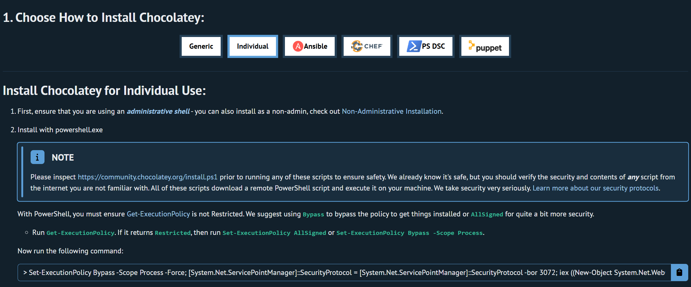
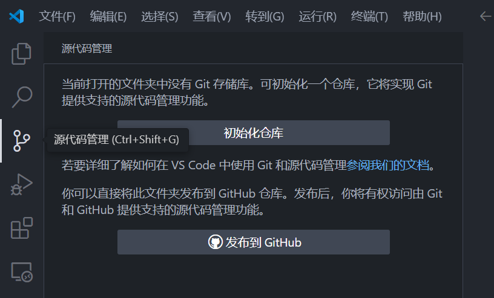

# 速通版本管理工具

- [速通版本管理工具](#速通版本管理工具)
  - [接触版本管理](#接触版本管理)
  - [下载与安装 git](#下载与安装-git)
    - [安装社区软件管理工具巧克力](#安装社区软件管理工具巧克力)
    - [使用巧克力安装git](#使用巧克力安装git)
    - [利用vscode提供的git工具](#利用vscode提供的git工具)
  - [git是怎样处理版本管理问题的](#git是怎样处理版本管理问题的)
  - [让vscode帮助你操作git](#让vscode帮助你操作git)
  - [仓库投递到github](#仓库投递到github)

阅读本文，你将了解到：

1. 什么是版本管理，版本管理的基本模式是什么
2. 下载安装 git 工具的几个方法
3. 使用 git 完成版本管理
4. 使用 github 保存一些仓库

## 接触版本管理

版本管理一般用在开发中，产品功能迭代时。

例如程序员面对的函数功能 `ReadFromSerialPort()` 可能经过了几代人的修改，我需要**保留所有人的修改记录**，**便于翻阅**，如果出bug了还要**快速回溯**。

使用版本管理工具就可以快速满足我们的需求，在本文，我们将使用 git 工具，完成一个简单的代码管理过程。

## 下载与安装 git

~~如果你使用的是 ubuntu ，那么我直接默认你已经会使用 git 了~~

以下教程仅适用于 Windows 里面那些能看懂人话并且百度的人，或者能直接问问题的人。

推荐按照此流程来，因为可以避免许多不必要的问题。

### 安装社区软件管理工具巧克力

打开[巧克力官网链接](https://chocolatey.org/install#individual)。
打开后长这样。



使用管理员权限运行 powershell 软件，这里是[教程链接](https://digitalixy.com/windows/1060520.html)。

在 powershell 中粘贴并运行如下代码：

```ps
Set-ExecutionPolicy Bypass -Scope Process -Force; [System.Net.ServicePointManager]::SecurityProtocol = [System.Net.ServicePointManager]::SecurityProtocol -bor 3072; iex ((New-Object System.Net.WebClient).DownloadString('https://community.chocolatey.org/install.ps1'))
```

等待一会，看着屏幕上的提示，如果需要输入 `Yes` `All` 等内容，输入开头的字母即可  
推荐直接输入 A，因为我们需要程序的所有内容。  
屏幕上的提示是程序在等待用户是否同意程序执行某些安装代码，不同意就不会继续安装。  
输入 Y 也就是 `Yes` 意思是同意一次。  
输入 A 也就是 `All` 意思是同意所有。

为什么要打开那个官网链接呢？  
因为网络不好的用户不能直接使用上述代码，所以会卡在那一步然后应该会主动来问（

### 使用巧克力安装git

还是在管理员权限的 powershell 窗口中，输入 

```ps
choco install git
```

输入 `A` 全部同意。

安装完成后关闭窗口，接下来就可以愉快使用命令行模式的 git 工具了。

### 利用vscode提供的git工具

很多人依然是不喜欢使用命令行的，我们可以通过 vscode 提供的工具管理仓库。

安装 vscode 即可，这里是[教程链接](https://blog.csdn.net/msdcp/article/details/127033151)。  
里面有关安装额外插件的内容我们可以忽略，如果喜欢可以自行探索。

## git是怎样处理版本管理问题的

你需要了解如下内容：

[git的工作流](https://www.runoob.com/git/git-workflow.html)
[git的工作区](https://www.runoob.com/git/git-workspace-index-repo.html)
剩余内容可以选择自己看，知道有个地方有个软件用某种方式帮你整理文件即可，你只需要做的是掌握一些基础指令的使用。  
或者你也可以掌握 vscode 的使用。

## 让vscode帮助你操作git

最喜欢的点点点时间！

让我们来到一般的场景：我之前没使用过 git，现在代码是半成品，需要迭代，我该怎么办？

首先让我们使用vscode打开文件夹。

（安装中文插件！[这里是教程](https://blog.csdn.net/danshiming/article/details/132110419)）

去最左边，找到 `源代码管理` 功能，这样：



点击初始化仓库，现在就创建好了 git 仓库了。

先别急着把文件都上交上去，先写 `.gitignore` 文件，这个文件是用来让 git 忽略一些文件和文件夹的，防止我们把一些与项目无关的内容到 git 里面，随着项目的进行永久保存在项目中。

在当前文件夹下面创建 `.gitignore` 文件，添加一行

```gitignore
.vscode
```

这样就忽略 vscode 文件夹了。

现在 commit 所有重要的内容吧。
在 `源代码管理` 里面输入消息，意思是这次提交的内容大概包括啥，然后点提交即可。

## 仓库投递到github

TODO 涉及到创建 github 账号等一系列问题，有时间再写。
